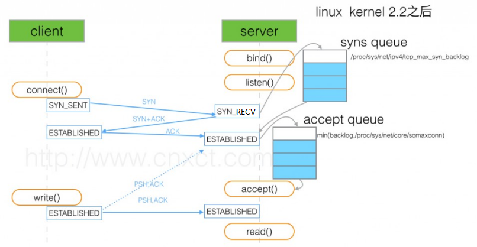

# TCP 三次握手

在三次握手过程中, 服务端维护一个半连接队列( sync queue ) 和一个全连接队列( accept queue ). 当服务端接收到客户端第一次SYN握手请求时，将创建的request_sock结构，存储在半连接队列中（向客户端发送SYN+ACK，并期待客户端响应ACK），此时的连接在服务器端出于SYN_RECV状态。当服务端收到客户端最后的ACK确认时，将半连接中的相应条目删除，然后将相应的连接放入 全连接队列中， 此时服务端连接状态为ESTABLISHED。 进入全连接队列中的连接等待accept()调用取用。

半连接队列的大小受 /proc/sys/net/ipv4/tcp_max_syn_backlog 控制. 全连接队列长度由 min( /proc/sys/net/core/somaxconn, 服务程序 listen 函数传入参数 )控制. 两个内核参数可以通过在 /etc/sysctl.conf 中添加 net.ipv4.tcp_max_syn_backlog=2048 net.core.somaxconn=2048 控制.

通过 ss -l 可以查看监听状态下各队列的大小( -t 可以仅查看 tcp ). Send-Q 表示 accept queue 的最大值, Recv-Q 表示 accept queue 当前的大小.

通过 netstat -s 可以查看各协议的统计信息. netstat -s | grep LISTEN 可以查看SYN 队列是否溢出. netstat -s | grep TCPBacklogDrop 可以查看 accept 队列溢出.
