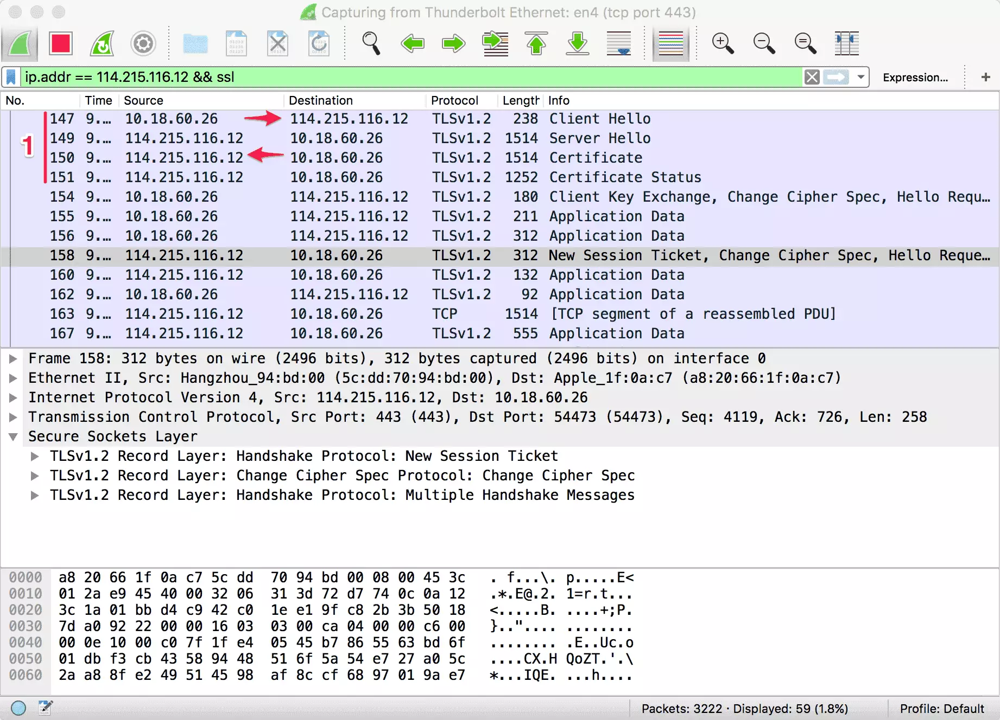

# TLS 握手优化详解

摘自: <https://imququ.com/post/optimize-tls-handshake.html>

随着 HTTP/2 的逐渐普及，以及国内网络环境越来越糟糕（运营商劫持和篡改），HTTPS 已经开始成为主流。HTTPS 在 TCP 和 HTTP 之间增加了 TLS（Transport Layer Security，传输层安全），提供了内容加密、身份认证和数据完整性三大功能，同时也给 Web 性能优化带来新的挑战。上次写的[「使用 BoringSSL 优化 HTTPS 加密算法选择」][1]一文中，我介绍了如何针对不同平台启用最合适的传输加密算法。本篇文章我打算继续写 HTTPS 优化 —— TLS 握手优化。

TLS 的前身是 SSL（Secure Sockets Layer，安全套接字层），由网景公司开发，后来被 IETF 标准化并改名。通常没有特别说明时，SSL 和 TLS 指的是同一个协议，不做严格区分。

## TLS 握手

在传输应用数据之前，客户端必须与服务端协商密钥、加密算法等信息，服务端还要把自己的证书发给客户端表明其身份，这些环节构成 TLS 握手过程，如下图所示：

可以看到，假设服务端和客户端之间单次传输耗时 28ms，那么客户端需要等到 168ms 之后才能开始发送 HTTP 请求报文，这还没把客户端和服务端处理时间算进去。光是 TLS 握手就需要消耗两个 RTT（Round-Trip Time，往返时间），这就是造成 HTTPS 更慢的主要原因。当然，HTTPS 要求数据加密传输，加解密相比 HTTP 也会带来额外的开销，不过对称加密本来就很快，加上硬件性能越来越好，所以这部分开销还好。

详细的 TLS 握手过程这里就不介绍了，大家可以通过这两篇文章去了解：

  [大型网站的 HTTPS 实践（一）—— HTTPS 协议和原理][2]
  [Keyless SSL: The Nitty Gritty Technical Details][3]

通过 Wireshark 抓包可以清楚地看到完整 TLS 握手过程所需的两个 RTT，如下图：

## False Start

False Start 有抢跑的意思，意味着不按规则行事。TLS False Start 是指客户端在发送 Change Cipher Spec Finished 同时发送应用数据（如 HTTP 请求），服务端在 TLS 握手完成时直接返回应用数据（如 HTTP 响应）。这样，应用数据的发送实际上并未等到握手全部完成，故谓之抢跑。这个过程如下图所示：

可以看到，启用 False Start 之后，TLS 阶段只需要一次 RTT 就可以开始传输应用数据。False Start 相当于客户端提前发送加密后的应用数据，不需要修改 TLS 协议，目前大部分浏览器默认都会启用，但也有一些前提条件：

* 服务端必须在 Server Hello 握手中通过 NPN（Next Protocol Negotiation，下一代协议协商，Google 在 SPDY 协议中开发的 TLS 扩展，用于握手阶段协商应用协议）或 ALPN（Application Layer Protocol Negotiation，应用层协议协商，NPN 的官方修订版）表明自己支持的 HTTP 协议，例如：http/1.1、http/2；
* 使用支持前向安全性（Forward Secrecy）的加密算法。False Start 在尚未完成握手时就发送了应用数据，Forward Secrecy 可以提高安全性；

通过 Wireshark 抓包可以清楚地看到 False Start 带来的好处（服务端的 ChangeCipherSpec 出现在 158 号包中，但在之前的 155 号包中，客户端已经发出了请求，相当于 TLS 握手只消耗了一个 RTT）：

## Certificate

TLS 的身份认证是通过证书信任链完成的，浏览器从站点证书开始递归校验父证书，直至出现信任的根证书（根证书列表一般内置于操作系统，Firefox 自己维护）。站点证书是在 TLS 握手阶段，由服务端发送的。

## Certificate-Chain

配置服务端证书链时，有两点需要注意：1）证书是在握手期间发送的，由于 TCP 初始拥塞窗口的存在，如果证书太长可能会产生额外的往返开销；2）如果证书没包含中间证书，大部分浏览器可以正常工作，但会暂停验证并根据子证书指定的父证书 URL 自己获取中间证书。这个过程会产生额外的 DNS 解析、建立 TCP 连接等开销，非常影响性能。

配置证书链的最佳实践是只包含站点证书和中间证书，不要包含根证书，也不要漏掉中间证书。大部分证书链都是「站点证书 - 中间证书 - 根证书」这样三级，这时服务端只需要发送前两个证书即可。但也有的证书链有四级，那就需要发送站点证书外加两个中间证书了。

通过 Wireshark 可以查看服务端发送的证书链情况，如下图。可以看到本站发送了两个证书，共 2270 字节，被分成 2 个 TCP 段来传输。这已经算小的了，理想的证书链应该控制在 3kb 以内。

## ECC Certificate

如果需要进一步减小证书大小，可以选择 ECC（Elliptic Curve Cryptography，椭圆曲线密码学）证书。256 位的 ECC Key 等同于 3072 位的 RSA Key，在确保安全性的同时，体积大幅减小。下面是一个对比：

对称加密 Key 长度 | RSA Key 长度 | ECC Key 长度
--- | --- | ---
80  | 1024 | 160
112 | 2048 | 224
128 | 3072 | 256
192 | 7680 | 384
256 | 15360 | 521

如果证书提供商支持 ECC 证书，使用以下命令生成 CSR（Certificate Signing Request，证书签名请求）文件并提交给提供商，就可以获得 ECC 证书：

> openssl ecparam -genkey -name secp256r1 | openssl ec -out ecc.key
> openssl req -new -key ecc.key -out ecc.csr

以上命令中可以选择的算法有 secp256r1 和 secp384r1，secp521r1 已被 Chrome 和 Firefox 抛弃。

ECC 证书这么好，为什么没有普及呢？最主要的原因是它的支持情况并不好。例如 Windows XP 不支持，导致使用 ECC 证书的网站在 Windows XP 上只有 Firefox 能访问（Firefox 证书那一套完全自己实现，不依赖操作系统）。另外，Android 平台也只有 Android 4+ 才支持 ECC 证书。所以，确定使用 ECC 证书前需要明确用户系统分布情况。

## Session Resumption

另外一个提高 TLS 握手效率的机制是会话复用。会话复用的原理很简单，将第一次握手辛辛苦苦算出来的对称密钥存起来，后续请求中直接使用。这样可以节省证书传送等开销，也可以将 TLS 握手所需 RTT 减少到一个，如下图所示：

可以看到会话复用机制生效时，双方几乎不怎么交换数据就协商好密钥了，这是怎么做到的呢？

### Session Identifier

Session Identifier（会话标识符），是 TLS 握手中生成的 Session ID。服务端可以将 Session ID 协商后的信息存起来，浏览器也可以保存 Session ID，并在后续的 ClientHello 握手中带上它，如果服务端能找到与之匹配的信息，就可以完成一次快速握手。

### Session Ticket

Session Identifier 机制有一些弊端，例如：1）负载均衡中，多机之间往往没有同步 Session 信息，如果客户端两次请求没有落在同一台机器上就无法找到匹配的信息；2）服务端存储 Session ID 对应的信息不好控制失效时间，太短起不到作用，太长又占用服务端大量资源。

而 Session Ticket（会话记录单）可以解决这些问题，Session Ticket 是用只有服务端知道的安全密钥加密过的会话信息，最终保存在浏览器端。浏览器如果在 ClientHello 时带上了 Session Ticket，只要服务器能成功解密就可以完成快速握手。

配置 Session Ticket 策略后，通过 Wireshark 可以看到服务端发送 Ticket 的过程：

以下是 Session Resumption 机制生效时的握手情况，可以看到没有发送证书等环节：

### 测试网站

Github 上有一个名为 [rfc5077][4] 的项目，非常适合用来测试服务端对 Session ID 和 Session Ticket 这两种 TLS 会话复用机制的支持情况。下面简单介绍如何使用这个工具。

首先，安装工具所需依赖（以下所有步骤仅在 Ubuntu 14.04.4 LTS 测试通过）：
> sudo apt-get install -y pkg-config libssl-dev libev-dev libpcap-dev libgnutls-dev libnss3-dev

然后就可以获取源码，开始编译：
> git clone https://github.com/vincentbernat/rfc5077.git
> cd rfc5077/
> git submodule init
> git submodule update
> make
编译完成后，当前目录会出现多个可执行文件。这里我们只会用到 rfc5077-client，它的用法是这样的：
> ./rfc5077-client [-p {port}] [-s {sni name}] [-4] host [host ...]

* -p 用于指定连接的端口，默认是 443；
* -s 用于指定 SNI，如果同 IP 同端口部署了多个 HTTPS 网站，需要通过这个参数指定 SNI；
* -4 表示只使用 IPV4 地址；
* 命令最后需要可以跟一个或多个 HOST（域名或 IP）；

这个工具会先禁用 Session Ticket 将所有 HOST 都测试一遍，然后开启 Session Ticket 再测试一遍。下面是对本站两个 IP 进行测试的命令：
> ./rfc5077-client -s imququ.com 114.215.116.12 139.162.98.188

测试结果:

从以上结果可以看出：禁用 Session Ticket 时，每次连接到不同 IP 都会导致 Session 无法复用；而启用 Session Ticket 后，不同 IP 之间也可以复用 Session。符合前面的结论。

值得注意的是，为了让一台服务器生成的 Session Ticket 能被另外服务器承认，往往需要对 Web Server 进行额外配置。例如在 Nginx 中，就需要通过 ssl_session_ticket_key 参数让多台机器使用相同的 key 文件，否则 Nginx 会使用随机生成的 key 文件，无法复用 Session Ticket。出于安全考虑，key 文件应该定期更换，并且确保换下来的 key 文件被彻底销毁.

## OCSP Stapling

出于某些原因，证书颁发者有时候需要作废某些证书。那么证书使用者（例如浏览器）如何知道一个证书是否已被作废呢？通常有两种方式：CRL（Certificate Revocation List，证书撤销名单）和 OCSP（Online Certificate Status Protocol，在线证书状态协议）。

CRL 是由证书颁发机构定期更新的一个列表，包含了所有已被作废的证书，浏览器可以定期下载这个列表用于验证证书合法性。不难想象，CRL 会随着时间推移变得越来越大，而且实时性很难得到保证。OCSP 是一个在线查询接口，浏览器可以实时查询单个证书的合法性。在每个证书的详细信息中，都可以找到对应颁发机构的 CRL 和 OCSP 地址。

OCSP 的问题在于，某些客户端会在 TLS 握手阶段进一步协商时，实时查询 OCSP 接口，并在获得结果前阻塞后续流程，这对性能影响很大。而 OCSP Stapling（OCSP 封套），是指服务端在证书链中包含颁发机构对证书的 OCSP 查询结果，从而让浏览器跳过自己去验证的过程。服务端有更快的网络，获取 OCSP 响应更容易，也可以将 OCSP 响应缓存起来。

OCSP 响应本身经过了数字签名，无法伪造，所以 OCSP Stapling 技术既提高了握手效率，也不会影响安全性。启用这项技术后，也可以通过 Wireshark 来验证：

可以看到，服务端在发送完证书后，紧接着又发来了它的 OCSP 响应，从而避免了浏览器自己去验证证书造成阻塞。需要注意的是，OCSP Stapling 只能包含一个 OCSP 响应，浏览器还是可能自己去验证中间证书。另外，OCSP 响应本身会占用几 kb 的大小。

OCSP Stapling 功能需要 Web Server 的支持，主流的 Nginx、Apache 和 H2O 都支持 —— 但同时还取决于使用的 SSL 库 —— 例如 BoringSSL 不支持 OCSP Stapling，使用 BoringSSL + Nginx 就无法开启 OCSP Stapling。

如何使用 Nginx 配置本文这些策略，可以参考我之前的文章：本博客 [Nginx 配置之性能篇][5]。
最后，强烈推荐 Qualys SSL Labs 的 [SSL-Server-Test][6] 工具，可以帮你查出 HTTPS 很多配置上的问题。本博客的测试结果见[这里][7]。

本文一部分内容来自于 Google 性能专家 Ilya Grigorik 写的《High Performance Browser Networking》第四章：Transport Layer Security (TLS)。这是一本可以免费在线阅读，一直都在更新的性能优化好书，本博客多次推荐。本书中文翻译由李松峰老师负责，已经出版，名为《WEB 性能权威指南》。

[1]: <https://imququ.com/post/optimize-ssl-ciphers-with-boringssl.html>
[2]: <https://developer.baidu.com/resources/online/doc/security/https-pratice-1.html>
[3]: <https://blog.cloudflare.com/keyless-ssl-the-nitty-gritty-technical-details/>
[4]: <https://github.com/vincentbernat/rfc5077>
[5]: <https://imququ.com/post/my-nginx-conf-for-wpo.html#toc-4>
[6]: <https://www.ssllabs.com/ssltest/index.html>
[7]: <https://www.ssllabs.com/ssltest/analyze.html?d=imququ.com&latest>
